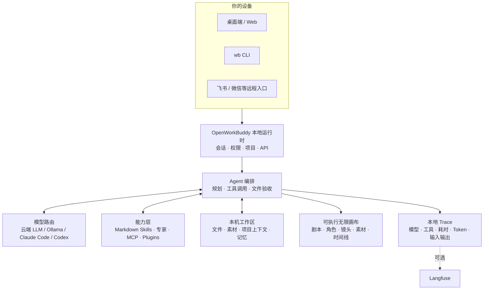

<p align="center">
  
</p>

<h1 align="center">OpenWorkBuddy</h1>

<p align="center">
  <b>让 AI 真正替你交付工作的本机 Agent。</b><br>
  把需求和材料交给它：自己规划、动手、验收，把 PPT / Word / Excel / 网页落到你的电脑；<b>交付的是可打开的文件，不是一段聊天记录。</b>
</p>

<p align="center">
  <sub>A local-first AI office agent that hands you files, not chat logs. → <a href="README.en.md"><b>English README</b></a></sub>
</p>

<p align="center">
  <sub>适合本地部署办公、把 Agent 用进真实交付、或想从模型、工具、记忆、Trace 一路读懂 Agent 的人。项目持续迭代，欢迎你一起维护。</sub>
</p>

<p align="center">
  <a href="#跑起来"><b>⚡ 三分钟跑起来</b></a> ·
  <a href="https://github.com/CatCatUncle/openworkbuddy/releases">下载安装包</a> ·
  <a href="#第一次上手">第一次上手</a> ·
  <a href="#技术架构">技术架构</a> ·
  <a href="#roadmap">Roadmap</a> ·
  <a href="#一起把它做下去">贡献一个能力</a> ·
  <a href="CHANGELOG.md">变更记录</a> ·
  <a href="#交流群">飞书交流群</a> ·
  <a href="docs/功能清单.md">功能清单</a>
</p>

<p align="center">
  <a href="https://github.com/CatCatUncle/openworkbuddy/stargazers"></a>
  <a href="https://github.com/CatCatUncle/openworkbuddy/forks"></a>
  <a href="LICENSE"></a>
</p>

<p align="center">
  <sub>个人、学习、非营利用途<b>免费</b>；公司里用需要授权，<a href="#协议">一句话讲清 ↓</a></sub>
</p>

<p align="center">
  
</p>

---

## 第一次上手

**最快的验证方式：下载 → 选一个模型 → 把下面这句话贴进输入框。**

> 把我拖进来的材料整理成一页清晰的要点，并交付为一个可打开的 Markdown 文件。

它会在右侧留下真实文件；点击即可预览、下载或继续让它修改。没有材料？直接说「帮我做一份本周工作周报」，也能先跑通完整闭环。

**想持续关注 OpenWorkBuddy？点个 Star 把它收藏起来；再点仓库右上角 `Watch → All Activity`，GitHub 会把项目动态及时通知给你。** 每一个 Star 都会帮更多正在找本地 AI 助理的人发现这个项目，也告诉我们哪些能力值得继续打磨。

## 为什么是它

**交付的是文件，不是聊天记录。** PPT / Word / Excel / 网页都是真生成的，成果面板里点开就能验收。声称写了文件却不在磁盘上，会被当场拦下重做。

**不绑任何一家模型，东西都在你手里。** DeepSeek / 通义 / 智谱 / Kimi / OpenRouter / Ollama 本地模型界面点一下就切；本机装了 **Claude Code / Codex** 的，一键拿它当发动机，不再另买 token。自托管，会话、文件、Key 全在本机，默认只监听 `127.0.0.1`。

**加一个能力 = 丢一个 Markdown 文件。** 存成 `skills/<名字>/skill.md`，存盘后下一条任务就生效——不改代码、不重启、不打包。往外接 MCP 连接器和 [Agent Plugins](https://agent-plugins.org) 开放标准，别人的插件粘个 GitHub 地址就装。

**既能拿来干活，也适合拿来学 Agent。** 模型路由、工具调用、文件验收、技能、连接器、记忆、权限和本地 Trace 都在同一个开源仓库里；你能从一条真实任务一路看到 Agent 为什么这样做、用了什么模型、每步花了多久、最后交付了什么。

## 技术架构

一台机器就能跑完整闭环：入口、Agent、模型、工具、工作区和可观测性彼此解耦；需要时再接入飞书、微信或 Langfuse，默认不把本机文件和会话送到公网。



这张图也是读代码的路线：从 `server.js` 的本地运行时进入，再看 `agent.js` 如何编排模型和工具；画布、CLI、IM 与 Trace 都是同一条交付链上的不同入口或观察点。

## 和其他 Agent 的位置

OpenWorkBuddy 不试图替代所有工具：Codex / Pi 更偏终端与代码，Claude Cowork / Manus 更偏托管式通用工作，OpenClaw / Hermes 更偏个人自动化与多渠道 Agent，WorkBuddy 更偏企业协作与治理。它的取舍是：把“本机文件交付 + 可安装能力 + IM 远程指挥 + AI 短剧无限画布”放进一个可自托管的工作台。

| 维度 | OpenWorkBuddy | Codex / Pi | Claude Cowork / Manus | OpenClaw / Hermes | WorkBuddy |
|---|---|---|---|---|---|
| 核心定位 | 本地文件交付 + Agent 工作台 | 终端 / 编程 Agent | 通用知识工作 / 云端浏览器 | 个人自动化与 Agent 平台 | 企业级 Agent 工作台 |
| 本地优先 | 会话、文件、模型 Key 默认在本机 | 终端工作流为主 | Cowork 可访问授权文件；Manus 主要在云端执行 | 依部署方式而定 | 云端能力与企业部署并存 |
| AI 短剧创作 | 原生无限画布：角色、场景、镜头、首帧、视频、音频、时间线 | 需自行搭建工作流 | 没有本项目的短剧画布闭环 | 需自行编排 | 通用内容生产，不以短剧画布为核心 |
| 可视化关系 | DAG 连线、紧凑排版、框选、撤销/重做、右侧预览 | 以终端 / 对话为主 | 过程可跟随，但不是同一张创作图 | 视前端与插件而定 | 任务与专家协作视图为主 |
| 能力扩展 | Markdown Skill、专家、专家团、MCP、Plugin，热安装 | CLI / 插件生态 | Skills、Connectors、Plugins | Skills / Channels / Tools | 企业技能、专家、连接器市场 |
| 远程指挥 | 飞书、微信 iLink、企微等，支持文件、图片、语音等 | 主要在终端 | Web / Desktop / Mobile / Connectors | 多渠道自动化是强项 | 企业 IM 与团队协作是强项 |
| 可观测性 | 内置本地 Trace：模型、工具、耗时、Token、输入输出；可选 Langfuse | 依工具链配置 | 平台内过程可查看 | 依部署与插件 | 企业审计、用量和治理更完整 |
| 许可证与数据控制 | 开源、自托管、非商用免费；可接自己的模型 | 开源项目 / 各自模型策略 | 商业产品 | 开源项目 / 依组件 | 商业企业产品 |

上表只比较公开定位和本项目当前能力，不代表任何项目在所有场景都更好。对比对象包括 Codex、Pi、OpenClaw、Hermes Agent、Claude Cowork、Manus 与 WorkBuddy；请以各项目自己的最新文档和许可为准。

如果你觉得某一格不准确，欢迎直接提 Issue 或提交 PR：能复现、能验证、能落到代码里的反馈，我们会优先处理。

## 它替你做完的事

| 你说一句 | 它交给你 |
|---|---|
| 帮我出一份 Q3 复盘 PPT，数据用这个 Excel | 读表 → 算 → 一个能直接放的 `.pptx` |
| 调研国内 AI 陪伴产品，出一份报告 | 联网搜 → 逐个打开读 → Markdown / Word |
| 把这份材料做成手机上能看的网页 | 写 HTML → 起本机服务 → 扫码就能看（[成品长这样](https://hunan-travel.pages.dev/)） |
| 每天 9 点抓行业新闻，做成晨报发我飞书 | 定时任务 + IM 推送，错过了会补跑 |

> 还有多任务并行、Goal 目标验收、👍👎 反馈进自进化、双层记忆、权限档位、IM 远程指挥、桌面宠物……全部能力见 **[功能清单](docs/功能清单.md)**。

## AI 短剧无限画布

把一句话概念、剧本、角色、场景、分镜、参考图、视频、声音和剪辑时间线放在同一张**可执行的创作图**里。连线不是装饰：它表示下一步生成真正会读取的角色、场景、首尾帧或声音输入；人和 Agent 都可以继续补节点、改关系、重跑结果。

<p align="center">
  
</p>

<p align="center">
  
</p>

- **自由创作**：笔记、剧本、角色设定和分镜可以随时编辑、连接；一张画布就是一个独立短剧工程。
- **素材真正可用**：工作区图片、视频、音频可选择、拖入或上传，保留原比例预览；双击图片放大，素材可接到角色、场景或镜头。
- **生成能追溯**：分镜表、场次、镜头、首帧、视频、配音和时间线组成 DAG，自动排版仍保留原有生成关系。
- **和 Agent 同屏共创**：底部对话支持附件、`@` 引用节点或素材、模型和执行模式选择；Agent 的处理过程和结果留在当前画布任务里。

进入左侧「无限画布」即可开始。空画布只有剧本和分镜两个有实际意义的起点；空白处拖拽平移、`Shift`+拖拽框选，框选后拖任一节点可整体移动，属性只在点节点齿轮时打开。

## Roadmap

下面是明确的后续方向，不是已经发布的功能承诺；已完成内容以[功能清单](docs/功能清单.md)和[变更记录](CHANGELOG.md)为准。

| 方向 | 下一步 | 为什么值得做 |
|---|---|---|
| 短剧创作闭环 | 节点级下游重算与缓存、分镜到时间线交付、更多可复用短剧工作流 | 改一个镜头只影响必要的下游，降低重跑成本 |
| 素材与渠道 | 更顺畅的素材归档、引用与跨节点复用；继续打磨飞书、微信等附件交付 | 让参考图、音频、视频真正可找、可用、可交付 |
| 可观测与协作 | Trace 对比/回放、Langfuse 连接体验、跨机器任务查看与安全边界 | 让人和团队都能解释“Agent 做了什么、花了多久、为何失败” |
| 开源生态 | 更多经验证的 Skills、专家工作流、MCP 预设与贡献模板 | 让贡献者用更小的改动带来可复用能力 |

想参与其中，优先欢迎能复现的问题、真实任务样本（请脱敏）、小而完整的 Skill，以及能把一个卡点变成可测试改动的 PR。更详细的取舍和验收标准见[路线图](docs/路线图.md)。

## 长这样

**「同一个人，换四个场景，手里举一块写着字的牌子——要像随手拍的，别像 AI 图」**

<p align="center">
  
</p>

难的不是画个人，是**四张里得是同一个人**、木牌上的中文不能糊。它先出一张，再用看图工具真去读自己刚生的那张（不是凭记忆吹），确认光线和皮肤质感对了，才照这个方向铺开其余场景。图上不带任何 AI 生成水印。

**「做一个湖南旅游攻略网站，14 个市州一个都不能少」**

<p align="center">
  <a href="https://hunan-travel.pages.dev/"></a>
</p>

站在这儿，点开就能逛：**<https://hunan-travel.pages.dev/>**。14 个市州逐一拆开写，外加 3/5/7 天三条线路，单页 HTML、不挂任何外部 CDN，扔到静态托管上就是一个站。这不是截图拼的示意图，是它交出来的那个文件本身。

这两件事它是怎么做到的、本机 Claude Code 当发动机又长什么样 → **[三个案例，拆开讲](docs/案例.md)**

## 跑起来

**装包**：去 [Releases](https://github.com/CatCatUncle/openworkbuddy/releases) 下对应的包，打开后**五步向导**带你注册账号、粘 Key（当场验活）、选引擎——三分钟内说出第一句话。

| 系统 | 下哪个 |
|---|---|
| macOS · Apple 芯片 | `OpenWorkBuddy-*-mac-arm64.dmg` |
| macOS · Intel | `OpenWorkBuddy-*-mac-x64.dmg` |
| Windows 10/11（x64 与 ARM 同一个包，装时自动选） | `OpenWorkBuddy-*-win-setup.exe` |
| Windows 免安装版（**只在装不了软件时才用**） | `OpenWorkBuddy-*-win-x64-portable.exe` / `-win-arm64-portable.exe`（原理是自解压：每次启动要把整包解压到 `%TEMP%`，第一次可能要等好几分钟，期间只有进程没有窗口）|

> 第一次打开会被系统拦一下，因为这个包没有代码签名证书（苹果一年 99 美元、Windows 一年几千块，这是个免费开源项目），不是有毒。
> **Windows**：弹窗里点灰色小字「更多信息」→「仍要运行」。**macOS**：拖进「应用程序」后终端跑 `xattr -dr com.apple.quarantine /Applications/OpenWorkBuddy.app`，或 系统设置 → 隐私与安全性 → 「仍要打开」（右键图标 → 打开只在 macOS 14 及更早有效）。
> 你的数据在 `~/OpenWorkBuddy`，卸载不会删。
>
> **双击了没反应？** 启动日志在 `~/OpenWorkBuddy/logs/boot.log`，对照 [安装与启动 · 双击了没反应？](docs/安装与启动.md#双击了没反应) 逐条排查。

**从源码**（Node.js 18+，零构建零框架，改完刷新即生效）：

```bash
git clone https://github.com/CatCatUncle/openworkbuddy.git
cd openworkbuddy && npm install
npm run app     # 桌面版；或 npm start 走浏览器 http://localhost:3800
```

然后在输入框里说人话，比如「帮我做一份介绍 OpenWorkBuddy 的 PPT」。看着不顺眼就改：头像菜单 → **外观**，语言（中文 / English）/ 主题 / 六套皮肤 / 字号四档 / 字体 / 紧凑密度，点一下立刻生效。切成 English 后 AI 的回答和它写给你的文件也跟着用英文；首次开箱向导右上角就能切。（v1 只翻界面：服务端推过来的步骤标题、飞书/微信里的回复暂时还是中文。）

镜像、一键脚本、端口占用、启动卡住 → [安装与启动](docs/安装与启动.md)

## 放服务器给团队用

一台干净的 VPS，装好 Docker 之后一条命令：

```bash
git clone https://github.com/CatCatUncle/openworkbuddy.git && cd openworkbuddy
bash deploy.sh                              # 起在 127.0.0.1:3800
bash deploy.sh --domain buddy.example.com   # 或者：带自动 HTTPS，直接对外能用
```

脚本会构建镜像、起容器、**等健康检查真的通过**才说成功；起不来就把日志打给你，不假装。
数据全在 `./wb-data` 一个目录里（配置 / 账号 / 成果文件 / 技能 / 备份），容器随便删，那个目录别删。

起来之后**第一件事是注册管理员**——第一个注册的就是管理员，注册完默认不再允许别人自建账号；
空实例挂在公网上等于谁先访问谁是管理员。

**多租户 + 企业管理后台**：一个进程同时给多家公司用。成果文件、会话、账号、席位、用量账本、
审计各租户互相看不见；引擎和 API Key 归平台管理员。管理员登录后头像菜单 → **企业管理后台**，
建组织、分席位、看用量、配组织级安全策略——组织级那四个开关（`allow_shell` / `net_allow` /
`net_deny` / `session_days`）是真的会拦人的，不是摆着看的复选框。

反代配置、升级迁移、四个开关各自拦在哪一层、安全清单 → [部署](deploy/README.md)

## 配模型

**设置 → 模型**，选渠道预设（OpenAI / Anthropic / OpenRouter / 火山方舟 / 百炼 / DeepSeek / 智谱 / Kimi / Ollama），地址和协议自动填好，只差粘 Key，保存即热生效。对照表见 [配置模型](docs/配置模型.md)。带 reasoning 的模型能在界面里**关掉思考或调档**。

> `config.json` 是唯一存着 API Key 的文件，已在 `.gitignore` 里，**别手滑提交**。

## 命令行也能用

`wb` 跟桌面版共用同一份配置、技能、记忆和连接器，答案落到 stdout，能塞进任何管道、脚本和 cron：

```bash
npm link                                   # 一次性：把 wb 装成全局命令
wb "帮我写一份本周周报"                     # 单发：跑完就退，退出码 0/1 说实话
cat error.log | wb "这是什么问题"           # 管道：内容当附加材料一起送进去
wb --json "整理会议纪要" | jq -j 'select(.type=="text") | .delta'   # NDJSON 事件流给脚本用
wb engines && wb engines use claude-code   # 本机装了 Claude Code / Codex？一键拿它当底层
```

`-q` 只要答案、`-c` 续上一轮、`-C <目录>` 指定工作目录、`wb sessions` 列会话。全部参数 → [命令行用法](docs/命令行用法.md)。

## 最新动态

- **09-14** 增加 AI 短剧无限画布模式：剧本、角色、场景、分镜、素材、生成结果和本项目 Agent 在同一张可执行画布内协作，支持多张短剧工程、素材拖入、框选批量操作、自动排版和画布内对话
- **09-14** 优化无限画布短剧创作 UI：参考图/视频/音频可预览，图片支持放大查看，画布对话支持附件、`@` 引用节点与素材、执行模式和模型选择
- **09-13** 讲故事的片子能拍了：先把分镜表摆出来给你点头，再角色定妆照 → 每镜首帧 → 生视频 → 配音 → 拼成带字幕的竖版片；改哪一镜就只有那一镜再花钱
- **09-13** 配一条 SMTP，AI 就能把写好的报告、做好的文件直接发到对方邮箱；收件人白名单是硬闸，每封信出门前还要你看全文点头
- **09-13** AI 能自己排定时任务了：「每周一早九点把上周数据整理成表」说一句就定下，到点自己跑
- **09-13** 录音、会议视频、语音留言直接转文字，转完接着往下写纪要，不用自己再听一遍
- **09-13** 甲方发来的 Word / Excel / PPT / PDF 直接读，资料库里的素材随手取，做完的东西一句话推到群里
- **09-13** 终端里也看得到产出的图了：`/open` 交给系统程序打开，认得出的终端直接画在对话里
- **09-13** 做网页不再千篇一律：动笔前先挑视觉方向，同一个需求两次做出来不一样
- **09-13** 每一步花了多久直接写在卡上，收尾再记一笔账：工具占了多久、剩下多少是模型在想
- **09-13** 接 Langfuse 就能翻每次模型调用的原始输入输出，一层层点开看
- **09-11** 侧栏分「办公 / 工程」两条线；终端里 `wb` 起的活儿，手机上看得见、插得上话
- **09-11** 生图 / 生视频 / 配音 / 视觉都能配多个模型，同一家的 Key 只填一次
- **09-11** 「下载了打不开」修了六种，每种都有窗口说清原因，另附一份启动日志
- **09-10** 一条命令部署到服务器：`bash deploy.sh`，加 `--domain` 直接带 HTTPS
- **09-10** 多租户 + 企业管理后台：16 个面板，管理员、审计员、成员各看各的
- **09-08** 本机 Claude Code / Codex 当引擎，记忆、技能、读文件、生图配音全接上

更早的看 **[变更记录](CHANGELOG.md)**；每条对应的代码改动在 [commit 历史](https://github.com/CatCatUncle/openworkbuddy/commits/main)，提交信息写的是「为什么」。

## ⚠️ 这个 agent 手里有 shell

它能执行命令、读写文件、访问网络——所以闸门是真拦的：命令审批、文件黑名单、URL 白名单、审计日志、四档权限。**放到公网前务必先读 [安全](docs/安全.md)**，默认配置只为本机使用而调。

## 交流群

用崩了、有想法、想一起改，进飞书群直接说。飞书扫码：

<p align="center">
  
</p>

## 一起把它做下去

**觉得有用？点个 Star，让更多人找到它；想第一时间跟进进展，就在右上角点 `Watch → All Activity`。** 新能力、修复和版本动态都会持续在 GitHub 公开更新。

**用崩了、卡住了，开个 [issue](https://github.com/CatCatUncle/openworkbuddy/issues/new) —— 哪怕只贴一句报错。** 你以为「只有我遇到」的坑，多半所有人都在踩。贴之前扫一眼，别把 API Key 带上。

**想动手，按投入从小到大三条路：**

- **10 分钟** —— 写个技能。一个 Markdown 存成 `skills/<名字>/skill.md`，存盘即生效，[三分钟模板在这](CONTRIBUTING.md#提交一个技能3-分钟)
- **1 小时** —— 补一个模型渠道预设、修一处文档、给某个文件格式加上预览
- **一晚上** —— 挑个 issue 改。`npm install && npm start` 就跑起来，`npm test` 不需要 API Key 就能全绿

项目结构、测试、PR 规范都在 [参与贡献](CONTRIBUTING.md)。不用先开 issue 问，直接发 PR。

## 文档

| | |
|---|---|
| [功能清单](docs/功能清单.md) | 全部能力、内置技能与工具 |
| [案例](docs/案例.md) | README 上那几张图是怎么做出来的 |
| [安装与启动](docs/安装与启动.md) | 安装包、源码、Windows、常见卡壳 |
| [配置模型](docs/配置模型.md) | 各服务商 base_url / 模型名对照 |
| [命令行用法](docs/命令行用法.md) | CLI 参数、管道、`--json`、脚本和 cron |
| [扩展](docs/扩展.md) | 写技能、接 MCP、装插件、建专家 |
| [IM 与定时任务](docs/IM与定时任务.md) | 飞书 / QQ / 企微 / 微信 / 钉钉，cron |
| [多人协作](docs/多人协作.md) | 多租户、账号、权限、积分额度 |
| [安全](docs/安全.md) | 审批闸门、黑白名单、审计 |
| [部署](docs/部署.md) | 服务器 / Docker / 反代 |
| [实现细节](docs/实现细节.md) | agent 主循环怎么转的 |
| [UI 交互全景](docs/UI交互全景.md) | 每一处点击、拖拽、按键都在哪一行 |
| [路线图](docs/路线图.md) | 接下来做什么：无限画布、把企业方案里的工具搬回来 |
| [变更记录](CHANGELOG.md) | 一句话一条，最新在上面 |
| [参与贡献](CONTRIBUTING.md) | 项目结构、测试、提 PR |

## 协议

一句话：**自己用、学习用、非营利机构用——免费；拿去赚钱（公司内部提效也算）——找作者买商业授权。**
协议是 [PolyForm Noncommercial 1.0.0](LICENSE)，哪些算商用、怎么谈见 [COMMERCIAL-LICENSE.md](COMMERCIAL-LICENSE.md)。

Copyright (c) 2026 开发者猫叔

## 免责

本项目是对腾讯 WorkBuddy 产品形态的独立开源实现，与腾讯没有任何关系，不含其任何代码或资源。「WorkBuddy」是其权利人的商标。
